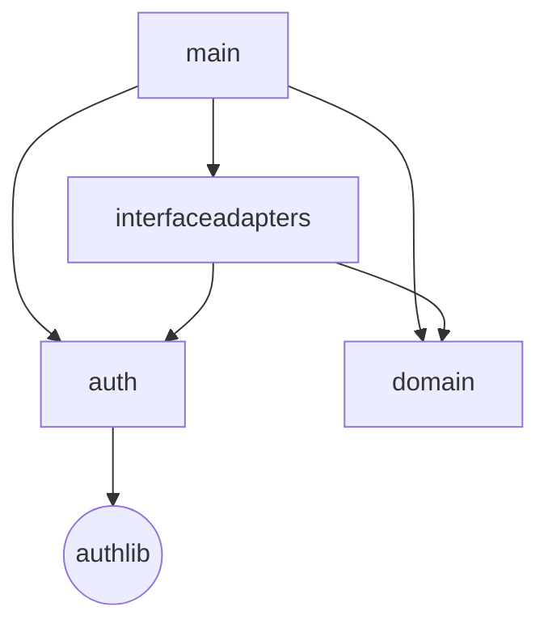
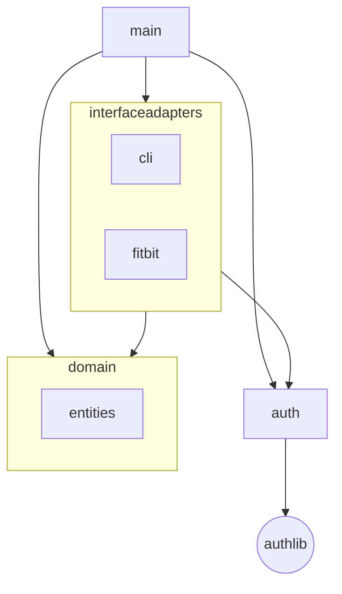
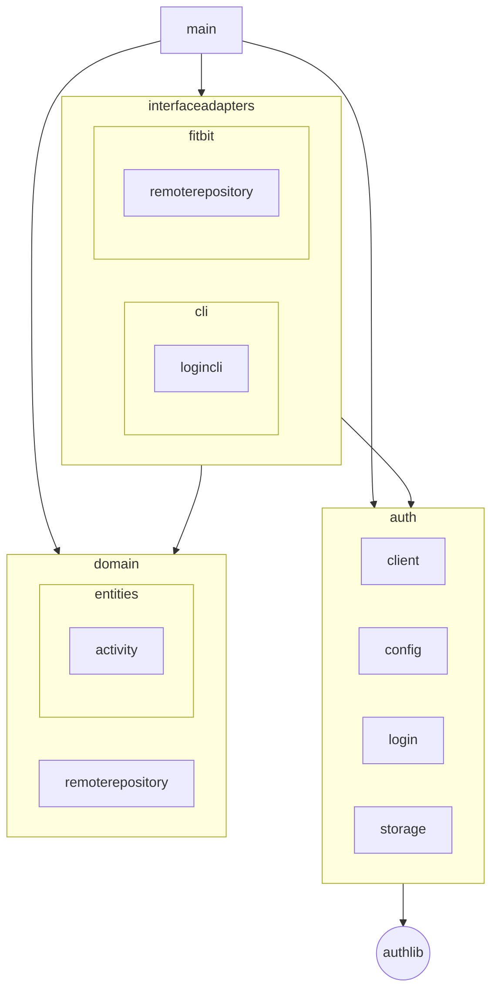

# Architecture

## Top-level packages, with top-level package dependencies

```mermaid
flowchart TD
    main
    auth
    domain
    interfaceadapters

    authlib(("authlib"))

    main --> auth
    main --> domain
    main --> interfaceadapters

    interfaceadapters --> domain
    interfaceadapters --> auth

    auth --> authlib
```

## All packages, with top-level package dependencies

```mermaid
flowchart TD
    main
    auth
    subgraph domain
        entities
    end
    subgraph interfaceadapters
        cli
        fitbit
    end

    authlib(("authlib"))

    main --> auth
    main --> domain
    main --> interfaceadapters

    interfaceadapters --> domain
    interfaceadapters --> auth

    auth --> authlib
```

## Packages and modules, with top-level package dependencies

```mermaid
flowchart TD
    main
    subgraph auth
        client
        config
        login
        storage
    end
    subgraph domain
        remoterepository
        subgraph entities
            activity
        end
    end
    subgraph interfaceadapters
        subgraph cli
            logincli
        end
        subgraph fitbit
            fitbitemoterepository["remoterepository"]
        end
    end

    authlib(("authlib"))

    main --> auth
    main --> domain
    main --> interfaceadapters

    interfaceadapters --> domain
    interfaceadapters --> auth
    auth --> authlib
```
